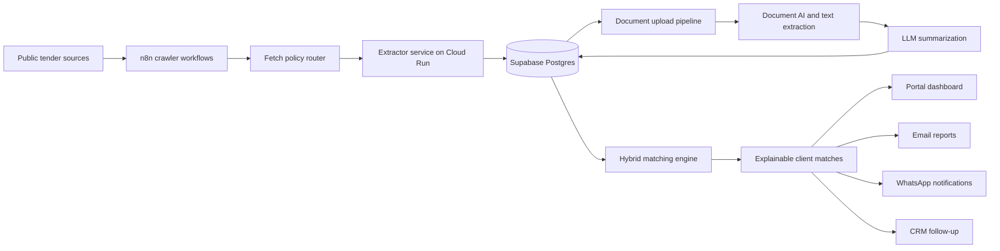

# AI Tender Intelligence Platform

Sanitized portfolio case study for an AI-powered public tender discovery, document intelligence, matching, and delivery platform.

This repository summarizes a production system I built while working on Noga, a tender intelligence platform associated with Locwise. The original product helps Israeli businesses decide which public tenders are worth pursuing by combining web crawling, document AI, LLM summarization, vector matching, client profiles, CRM workflows, email, and WhatsApp delivery.

This public repo is intentionally not a runnable copy of the production system. It is a safe technical portfolio artifact: architecture notes, representative schema, workflow skeletons, and small implementation samples.

## Problem

Small and mid-sized service providers often do not have time to monitor dozens of public tender sources, read long documents, identify requirements, and decide whether each opportunity is worth pursuing.

The platform automated the full lifecycle:

1. Discover public tender pages and documents.
2. Normalize messy source data into canonical tender records.
3. Extract and summarize tender documents.
4. Match open tenders against client profiles and service capabilities.
5. Explain why a tender is or is not a good fit.
6. Deliver results through portal views, email, WhatsApp, and CRM-linked workflows.

## What I Built

- Designed the end-to-end system architecture across ASP.NET Core, Supabase/PostgreSQL, n8n, GCP services, LLM APIs, WhatsApp Cloud API, Fireberry CRM, email delivery, and payment/onboarding flows.
- Built crawler and ingestion workflows for source discovery, fetch policy routing, source-specific extraction, document upload, retry tracking, and tender normalization.
- Designed the Supabase/PostgreSQL data model for clients, tenders, documents, summaries, matches, WhatsApp sessions, onboarding state, automation configs, domain events, and CRM identity mapping.
- Implemented a hybrid matching engine using PostgreSQL RPC functions, vector similarity, subscription-aware thresholds, LLM evaluation, explainable scoring, and match deduplication.
- Built multi-stage AI document processing workflows for summaries, structured fields, requirements, deadlines, certifications, risk notes, financial terms, and service-role extraction.
- Integrated CRM, WhatsApp, email, portal actions, and background automations through event-driven database patterns.
- Supported production operations with migrations, admin tooling, workflow exports, smoke tests, monitoring-friendly tables, and deployment pipelines.

I used AI as a development accelerator, but I owned the solution design, integration choices, debugging, data modeling, delivery, and production support.

## Architecture

See [docs/architecture.md](docs/architecture.md) for the sanitized system design.

## Repository Map

- [docs/architecture.md](docs/architecture.md) - platform architecture and event flows.
- [docs/data-model.md](docs/data-model.md) - sanitized data model and table responsibilities.
- [docs/workflows.md](docs/workflows.md) - crawler, document AI, matching, CRM, and WhatsApp workflow descriptions.
- [docs/security-and-sanitization.md](docs/security-and-sanitization.md) - what was removed and why.
- [docs/project-review.md](docs/project-review.md) - sanitized review of the original system and what it proves.
- [docs/improvement-roadmap.md](docs/improvement-roadmap.md) - practical hardening and portfolio improvement backlog.
- [docs/portfolio-copy.md](docs/portfolio-copy.md) - GitHub, LinkedIn, and resume-ready project copy.
- [examples/schema/sanitized_schema.sql](examples/schema/sanitized_schema.sql) - representative PostgreSQL schema excerpt.
- [examples/sql/rank_open_tenders_for_client.sql](examples/sql/rank_open_tenders_for_client.sql) - simplified hybrid ranking RPC.
- [examples/sql/upsert_client_match.sql](examples/sql/upsert_client_match.sql) - simplified explainable match upsert.
- [examples/data](examples/data) - synthetic client and tender records for explanation only.
- [examples/workflows](examples/workflows) - sanitized workflow skeletons.
- [examples/code](examples/code) - small representative C# integration snippets.

## What Is Not Included

- Production source code and original git history.
- Real Supabase project references, service-role keys, anon keys, database passwords, API keys, OAuth tokens, CRM tokens, WhatsApp tokens, iCredit credentials, webhook URLs, or cloud project identifiers.
- Raw n8n or Make exports from production.
- Real customer data, tender source credentials, CRM records, phone numbers, emails, or internal business rules.
- Full production database schema, migration history, or deployment pipeline files.

## Skills Demonstrated

Solutions engineering, business systems architecture, CRM implementation, workflow automation, API integration, data modeling, PostgreSQL, Supabase, pgvector, ASP.NET Core, n8n, GCP Cloud Run, Docker, LLM integration, Document AI, WhatsApp Cloud API, email automation, production support, and stakeholder-facing technical delivery.
