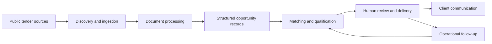

# AI Tender Intelligence Platform

Anonymized portfolio case study for an AI-powered tender discovery, document intelligence, matching, and delivery platform.

This repository is a public case study only. It summarizes the type of systems work I performed on an employer-associated production project while intentionally excluding source code, database schema, workflow exports, configuration, customer information, product names, implementation logic, and original repository history.

It is not an open-source version of the product and cannot be used to recreate the production system.

## Problem

Small and mid-sized service providers often do not have time to monitor dozens of public tender sources, read long documents, identify requirements, and decide whether each opportunity is worth pursuing.

The platform automated the full lifecycle:

1. Discover public tender pages and documents.
2. Normalize messy source data into canonical tender records.
3. Extract and summarize tender documents.
4. Match open tenders against client profiles and service capabilities.
5. Explain why a tender is or is not a good fit.
6. Deliver results through portal views, email, WhatsApp, and CRM-linked workflows.

## What I Built

- Participated in end-to-end solution design across discovery, architecture, implementation, delivery, and post-launch support.
- Helped design workflow automation for tender discovery, document processing, matching, delivery, and operational follow-up.
- Translated messy business requirements into structured system areas, user journeys, data responsibilities, and support workflows.
- Worked hands-on with APIs, databases, cloud services, workflow automation, CRM integration, messaging/email delivery, and LLM-based processing.
- Supported production operations through debugging, documentation, testing, and iterative improvement.

I used AI as a development accelerator, but I owned the solution design, integration choices, debugging, data modeling, delivery, and production support.

## Architecture

See [docs/architecture.md](docs/architecture.md) for the public-safe system overview.

## Repository Map

- [docs/architecture.md](docs/architecture.md) - high-level system overview.
- [docs/data-model.md](docs/data-model.md) - conceptual data responsibilities without table names or schema.
- [docs/workflows.md](docs/workflows.md) - workflow families and public-safe boundaries.
- [docs/security-and-sanitization.md](docs/security-and-sanitization.md) - what is intentionally excluded.
- [docs/project-review.md](docs/project-review.md) - portfolio positioning and skills demonstrated.
- [docs/improvement-roadmap.md](docs/improvement-roadmap.md) - safe public portfolio improvements.
- [docs/portfolio-copy.md](docs/portfolio-copy.md) - GitHub, LinkedIn, and resume-ready project copy.

## What Is Not Included

- Production source code, snippets, pseudocode, or original git history.
- Database schema, migrations, table names, SQL functions, stored procedures, or query logic.
- Workflow exports, workflow skeletons, node logic, webhook paths, credential names, or automation configuration.
- Product names, employer/client names, customer records, phone numbers, emails, financial records, or business-specific rules.
- Source-specific extraction strategies, ranking formulas, prompts, templates, deployment details, or operational runbooks.

## Skills Demonstrated

Solutions engineering, business systems architecture, CRM implementation, workflow automation, API integration, data modeling, cloud services, LLM integration, document processing, messaging/email delivery, production support, and stakeholder-facing technical delivery.
