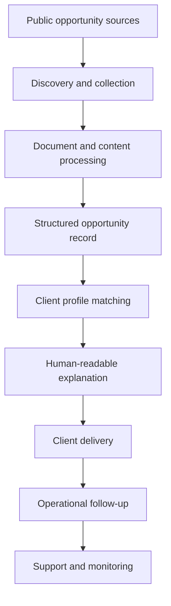

# Architecture

This document gives a public-safe overview of an AI tender intelligence platform. It intentionally omits product names, employer/client names, source code, table names, workflow logic, deployment details, credentials, source-specific extraction rules, prompts, and customer details.

## System Goals

- Convert fragmented public tender data into normalized business opportunities.
- Reduce manual review time by summarizing long tender documents into decision-ready facts.
- Match tenders to client business profiles with explainable scoring.
- Support multiple delivery channels without creating a manual operations bottleneck.
- Keep operational work traceable enough for support, retry, and review.

## Public-Safe Component Map

## Design Themes

- **Separation of concerns:** discovery, document processing, matching, delivery, and support were treated as separate system areas.
- **Human-readable AI output:** AI results needed to be explainable enough for business users to trust and review.
- **Operational resilience:** failed runs, unclear inputs, and external-service issues needed support paths instead of silent failure.
- **Business context first:** the system was designed around whether an opportunity was worth pursuing, not just whether data could be scraped.
- **Multi-channel delivery:** results had to reach users through the channels they already used.

This file intentionally does not document implementation sequence, infrastructure layout, table names, code contracts, source-specific rules, or private business logic.
