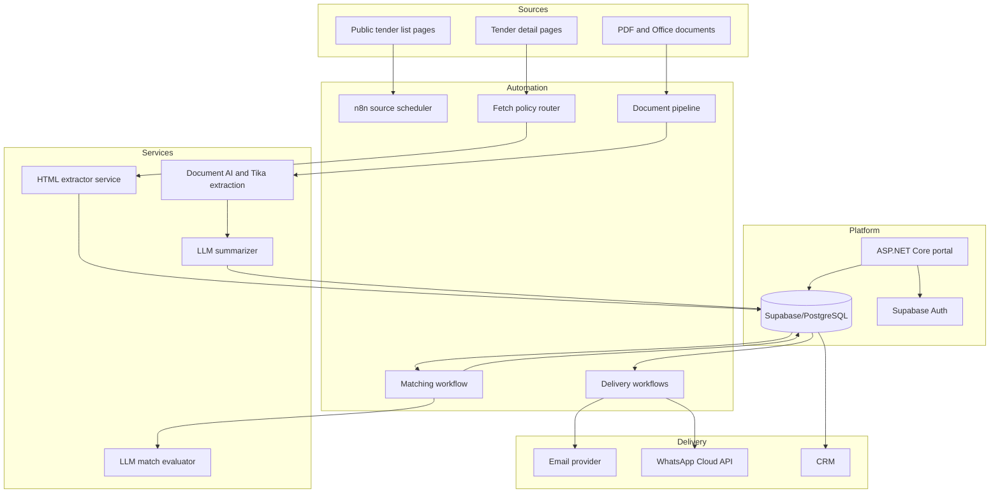
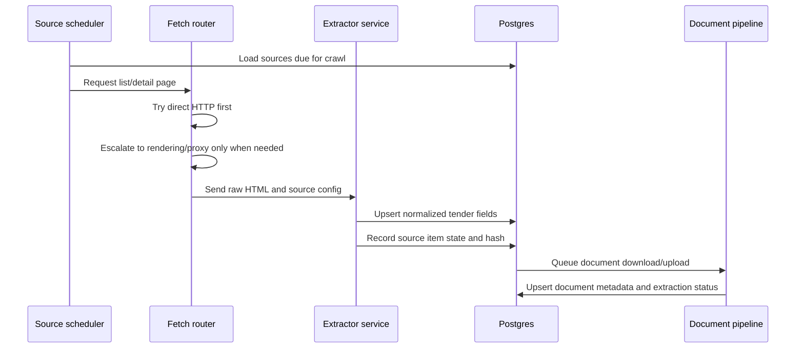
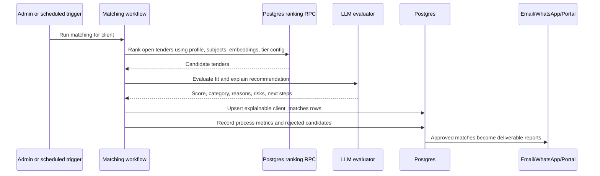
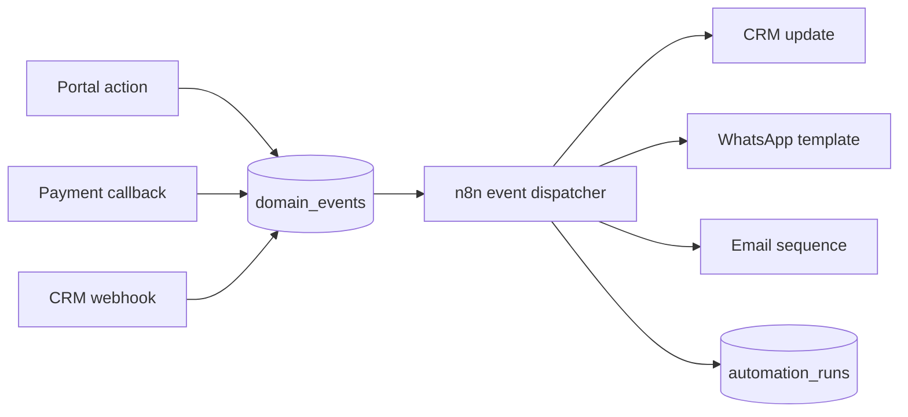

# Architecture

This document describes the sanitized architecture of the AI tender intelligence platform. Names, URLs, credentials, source-specific extraction rules, customer details, and production deployment details have been removed.

## System Goals

- Convert fragmented public tender data into normalized business opportunities.
- Reduce manual review time by summarizing long tender documents into decision-ready facts.
- Match tenders to client business profiles with explainable scoring.
- Support multiple delivery channels without tightly coupling the portal, CRM, and automations.
- Keep operational state visible in Postgres so failed automations can be retried and audited.

## High-Level Components

## Ingestion Flow

The ingestion layer used a cost-aware fetch policy: direct HTTP first, then escalation for sites requiring rendering or anti-bot workarounds. Extraction behavior was configuration-driven so new tender sources could be added without rewriting each workflow.

## Matching Flow

The matching layer combined deterministic database filters, vector similarity, subscription-specific thresholds, and LLM evaluation. This allowed the system to keep control over candidate selection while using the LLM for reasoning and explanation.

## Event-Driven Integration

The portal wrote business events into Postgres instead of calling every external system directly. Automation workers consumed those events, updated external systems, and wrote execution state back into the database.

This pattern made it easier to:

- Retry failed webhooks.
- Keep a durable audit trail.
- Add new automation behavior without changing portal code.
- Separate customer-facing actions from external-service reliability.

