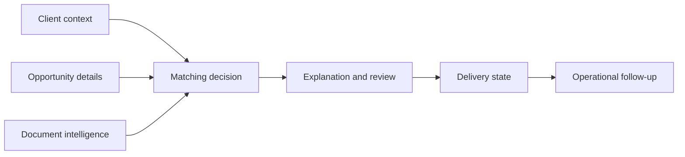

# Data Model

This document describes the conceptual data responsibilities behind the platform.

## Conceptual Areas

| Area | Responsibility |
| --- | --- | --- |
| Client profile | Stores the business context needed to decide whether opportunities are relevant. |
| Opportunity record | Holds normalized tender/opportunity details at a level useful for business review. |
| Document intelligence | Captures extracted requirements, deadlines, risks, and decision-support summaries. |
| Matching result | Stores fit category, explanation, review status, and delivery readiness. |
| Delivery state | Tracks whether a reviewed opportunity was delivered and through which channel family. |
| Operational state | Supports retry, monitoring, exception handling, and support review. |
| External identity mapping | Keeps external-system references separate from the core business records. |

## Relationship Sketch

## Design Choices

- **Normalize only what the business needs:** source data should become decision-ready information, not just a raw mirror of public pages.
- **Keep AI output reviewable:** summaries and matching explanations should be structured enough for users to understand why a recommendation was made.
- **Separate delivery from matching:** an opportunity can be relevant before it is approved, sent, or followed up on.
- **Track operational health:** support users need to know what ran, what failed, and what needs review.
- **Protect external-system coupling:** integration IDs and operational metadata should not drive core business logic.
