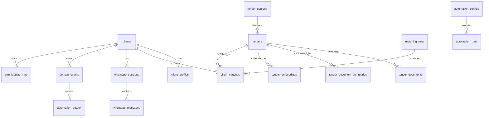

# Data Model

The production system used Supabase/PostgreSQL as the main application database, integration surface, and automation control plane. This public document describes the model at a safe level and links to a representative schema excerpt.

## Core Entity Groups

| Area | Representative tables | Responsibility |
| --- | --- | --- |
| Identity and clients | `clients`, `portal_users`, `client_profiles` | Customer identity, subscription tier, onboarding state, profile prompt, service domains, and matching preferences. |
| Tenders | `tenders`, `tender_sources`, `tender_documents` | Canonical public tender records, source metadata, document metadata, deadline/status fields, and source traceability. |
| AI summaries | `tender_document_summaries`, `tender_structured_facts` | Document-level summaries, requirements, risks, financial terms, certifications, deadlines, and extracted facts. |
| Matching | `tender_embeddings`, `client_matches`, `matching_runs`, `subscription_matching_config` | Vector search, candidate ranking, LLM evaluation results, match explanations, thresholds, and run metrics. |
| Delivery | `email_deliveries`, `whatsapp_sessions`, `whatsapp_messages` | Client communication state, report delivery, WhatsApp history, templates, and status callbacks. |
| Automation | `domain_events`, `automation_configs`, `automation_outbox`, `automation_runs` | Event-driven integration, scheduled automation, retries, leases, run logs, and failure tracking. |
| CRM mapping | `crm_identity_map` | Stable mapping between portal clients, CRM accounts, CRM opportunities, and automation events. |

## Relationship Sketch

## Design Choices

- **Canonical tender records:** source-specific data was normalized into a shared `tenders` model while preserving source metadata for auditability.
- **Separate document summaries:** document-level AI summaries were stored apart from tender-level summaries so a tender could be refreshed when documents changed.
- **Explainable matches:** match rows stored scores, categories, why-match bullets, why-not bullets, risk notes, badges, and delivery flags.
- **Subscription-aware ranking:** thresholds and candidate counts were data-driven so different client tiers could use different matching behavior.
- **Database-backed automation:** outbox, runs, leases, and retry counters lived in Postgres to make automation state inspectable from admin tooling.
- **CRM identity map:** external CRM identifiers were isolated from core client records to reduce coupling and make re-syncing safer.

See [../examples/schema/sanitized_schema.sql](../examples/schema/sanitized_schema.sql) for a representative SQL excerpt.

